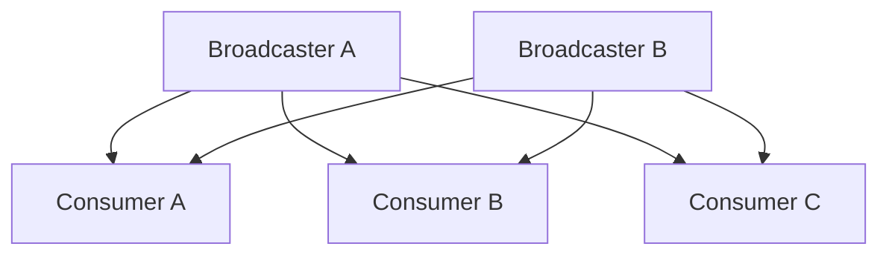
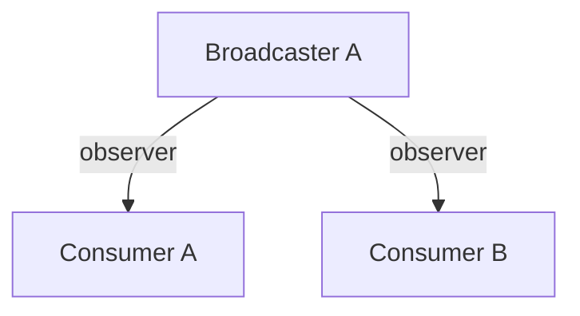
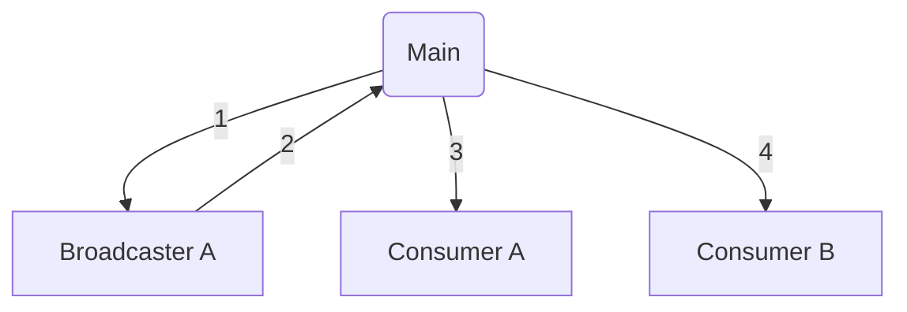

# Questions about your whole codebase

## The C++ observer pattern is hard in Rust. What to do?

The C++ observer pattern usually means:



where the broadcasters maintain lists of the consumers, and the consumers act in response to messages (often mutating their own state.)

This doesn't work in Rust, because it requires the broadcasters to hold mutable references to the consumers.

What do you do?

### Option 1: make everything runtime checked

Each of your consumers could become an `Rc<RefCell<T>>` (or its thread-safe equivalent, `Arc<RwLock<T>>`). Just like typical reference counting in C++, `Rc` and `Arc` have the option to provide a weak pointer, so the lifetime of each consumer doesn't need to be extended unnecessarily. (In Rust, you [may independently choose reference counting _or_ interior mutability](https://manishearth.github.io/blog/2015/05/27/wrapper-types-in-rust-choosing-your-guarantees/) - in this case we need both.)

Reference counting is frowned-upon in C++ because it's expensive. But, in Rust, not so much:

* Few objects are reference counted; the majority of objects are owned statically.
* Even when objects are reference counted, those counts are rarely incremented and decremented because you can (and do) pass around `&Rc<RefCell<T>>` most of the time. In C++, the "copy by default" mode means it's much more common to increment and decrement those reference counts.

In fact, the compile-time guarantees might cause you to do _less_ reference counting than C++:

> In Servo there is a reference count but far fewer objects are reference counted than in the rest of Firefox, because you don’t need to be paranoid - MG

(It would be nice if Rust had an `Rc`-like type which enforces exactly one owner, and multiple weak ptrs. `Rc` could be wrapped quite easily to do this.)

However: Rust does [not prevent reference cycles](https://doc.rust-lang.org/book/ch15-06-reference-cycles.html), although they're only possible in in the case you're using _both_ reference counting and interior mutability.

### Option 2: drive the objects from the code, not the other way round

In C++, it's common to have all behavior within classes. Those classes _are_ the total behavior of the system, and so they must interact with one another. The observer pattern is common.




In Rust, it's more common to have some _external_ function which drives overall behavior.



With that sort of design, it's relatively straightforward to take some output from object A, and pass it into object B, with no need for the objects to interact at all.

In the most extreme case, this becomes the [Entity-Component-System architecture](https://en.wikipedia.org/wiki/Entity_component_system) used in game design.

> Game developers seem to have completely solved this problem - we can learn from them. - MY

### Option 3: Use channels

The observer pattern is a way to decouple large, single-threaded C++ codebases. But if you're trying to decouple a codebase in Rust, perhaps you should assume multi-threaded by default? Rust has built-in [channels](https://doc.rust-lang.org/std/sync/mpsc/) and [crossbeam provides multi-producer, multi-consumer channels](https://docs.rs/crossbeam/0.8.0/crossbeam/).

> I'm a Rustacean, we assume massively parallel unless told otherwise :) - MG

## That's all very well, but I have an existing C++ object broadcasting events. How exactly should I observe it?

If your Rust object is a consumer of events from some pre-existing C++ producer, all the above options remain possible.

* You can make your object reference counted, and have C++ own such a reference (potentially a weak reference)
* C++ can deliver the message into some general message bucket. Some external function reads messages from that bucket, and invokes the right Rust object with which to handle it. This means the reference counting doesn't need to extend to the Rust objects outside that boundary layer.
* You can have some shim object which converts the C++ callback into some message that's injected into a channel-based world.

## Some of my C++ objects have shared mutable state. How can I make them safe in Rust?

You're going to have to do something with interior mutability: either `RefCell<T>` or its multithreaded equivalent, `RwLock<T>`.

You have three decisions to make:

1. Will only Rust code access _this particular instance_ of this object, or might C++ access it too?
2. If both C++ and Rust may access it, how do you avoid conflicts?
3. How should Rust code react if the object is not available, because something else is using it?

If only Rust code may be using this particular instance of shared state, then simply wrap it in `RefCell<T>` (single-threaded) or `RwLock<T>` (multi-threaded). Build a wrapper type such that callers aren't able to access the object directly, but instead only via the lock type.

If C++ also needs to access this particular instance of the shared state, it's more complex. There are presumably some invariants regarding use of this data in C++ - otherwise it would crash all the time. Perhaps it can be used only from one thread, or perhaps it can only be used with a given mutex held. Your goal is to translate those invariants into an idiomatic Rust API that can be checked (ideally) at compile-time, and (failing that) at runtime.

For example, imagine:

```cpp
class SharedMutableGoat {
public:
    void eat_grass(); // mutates tummy state
};

std::mutex lock;
SharedMutableGoat* billy; // only access when owning lock
```

Your idiomatic Rust wrapper might be:

```rust,ignore
struct SharedMutableGoat;
struct SharedMutableGoatLock {
    lock: ffi_lock_guard; // owns a std::lock_guard<std::mutex> somehow
};

impl SharedMutableGoat {
    fn get() -> SharedMutableGoatLock {
        SharedMutableGoatLock { lock: ffi::do_claim_lock() };
            // claims the lock, returns a new SharedMutableGoatLock
    }
}

impl SharedMutableGoatLock {
    fn eat_grass(&mut self) {
        ffi::do_eat_grass(); // Acts on the global goat
    }
}

impl Drop for SharedMutableGoatLock {
    ffi::release_lock(lock);
}
```

Obviously, lots of permutations are possible: but the goal is to ensure that it's simply compile-time impossible to act on the global state unless appropriate preconditions are met.

The final decision is how to react if the object is not available. This decision can apply with C++ mutexes or with Rust locks (for example `RwLock<T>`). As in C++, the two major options are available:

* Block until it becomes available.
* Try to lock, and if it's not available, do something else.

But a third option may be available if you're using async Rust. You may be able to return to your event loop in the event that such data isn't available using an async version of the lock ([Tokio example](https://docs.rs/tokio/1.5.0/tokio/sync/struct.RwLock.html#method.read), [async_std example](https://docs.rs/async-std/1.9.0/async_std/sync/struct.RwLock.html)).

## How do I do a singleton?

Use [OnceCell](https://docs.rs/once_cell/1.7.2/once_cell/) for now. [This should arrive in the standard library](https://doc.rust-lang.org/std/lazy/struct.Lazy.html) in future.

## What's the best way to retrofit Rust's parallelism benefits to an existing codebase?

When parallelizing an existing codebase, first check that all existing types are correctly [`Send`](https://doc.rust-lang.org/std/marker/trait.Send.html) and [`Sync`](https://doc.rust-lang.org/std/marker/trait.Sync.html). Generally, though, you should try to avoid implementing these yourself - instead use pre-existing wrapper types which enforce the correct contract (for example, [`RwLock`](https://doc.rust-lang.org/std/sync/struct.RwLock.html)).

After that,

> If you can solve your problem by throwing Rayon at it, do. It’s magic - MG

> If your task is CPU-bound, Rayon solves this handily. - MY

[Rayon](https://docs.rs/rayon/1.5.0/rayon/) offers parallel constructs which can readily be retrofitted to an existing codebase - for example parallel iterators. It also allows you to create and join tasks. Use of Rayon can also be a great code _simplification_ compared to lots of manual scheduling logic.

If your tasks are IO-bound, then you may need to look into async Rust, but that's hard to pull into an existing codebase.

## What's the best way to architect a new codebase for parallelism?

In brief, like in other language communities, you have a choice of architectures:

* Message-passing, using event loops which listen on a channel, receive `Send` data and pass it on;
* More traditional multithreading using `Sync` data structures such as mutexes (and perhaps Rayon).

> There's probably a bias towards message-passing, and that's probably well-informed by its extensibility. - MG

## I need a list of nodes which can refer to one another. How?

You can't easily do self-referential data structures in Rust. The usual workaround is to [use an arena](https://manishearth.github.io/blog/2021/03/15/arenas-in-rust/) where, instead of references from one node to another, you have node IDs.

An arena is typically a `Vec` (or similar) and the node IDs are a newtype wrapper around a simple integer index.

## I'm using an arena, but Rust obviously doesn't check that my node IDs are valid. If I don't have proper references, what stops me from having stale IDs?

First of all, arenas are often purely additive ([example](https://github.com/Manishearth/elsa/blob/master/examples/mutable_arena.rs)). But if you must have an arena which deletes things, then use generational IDs.

## Arenas sound like a nasty workaround. What do you have to say for yourself?

Well, maybe. But you might choose an arena anyway for other reasons:

* The rest of your program might have real Rust references into the arena. You can give the arena a named lifetime (`\`arena` for example), making the provenance of those references very clear.
* All of the objects in the arena will be freed at the end of the arena's lifetime, instead of during their manipulation, which can give very low latency for some use-cases. [Bumpalo](https://docs.rs/bumpalo/3.6.1/bumpalo/) formalizes this.

## I'm having a miserable time making my data structure due to the borrow checker.

C++ makes it hard to pull in third-party dependencies, but this is normal in
Rust. A typical Rust project will depend on at least 5-10 other crates, which in
turn will pull in lots of transitive dependencies.

The ability to use other people's data structures goes hand-in-hand with the
difficulty of creating your own. These two features of the Rust language have
co-evolved.

And so: if you're writing a data structure, you've probably made poor life
choices in the first place. You should be using somebody else's tried-and-tested
data structure. [petgraph](https://docs.rs/petgraph) and
[slotmap](https://docs.rs/slotmap) are great examples. Use someone else's crate
by default, and resort to writing your own only if you exhaust that option.

You might argue that this dependency on third-party crates is concerning
from a supply-chain security point of view. Your author would agree, but
it's just the way you do things in Rust. Stop creating your own data structures.

## Should I have a few big crates or lots of small ones?

In the past, it was recommended to have small crates to get optimal build time.
Incremental builds generally make this unnecessary now. You should arrange your
crates optimally for your semantic needs.

## What crates should everyone know about?

* [rayon](https://docs.rs/rayon/) - for parallelizing
* [serde](https://docs.rs/serde/) - for serializing and deserializing
* [crossbeam](https://docs.rs/crossbeam/) - for all sorts of parallelism tools
* [itertools](https://docs.rs/itertools/) - for making it slightly more pleasant
  to work with iterators. (For instance, if you want to join an iterator of
  strings, you can just go ahead and do that, without needing to collect the
  strings into a `Vec` first)
* [petgraph](https://docs.rs/petgraph/) - for graph data structures
* [slotmap](https://docs.rs/slotmap/) - arena-like
* [nom](https://docs.rs/nom/) - parsing
* [clap](https://docs.rs/clap/) - command-line parsing
* [regex](https://docs.rs/regex/) - err, regular expressions
* [ring](https://docs.rs/ring/) - the leading crypto library.
* [nalgebra](https://docs.rs/nalgebra/) - linear algebra
* [once_cell](https://docs.rs/once_cell/) - for complex static data
