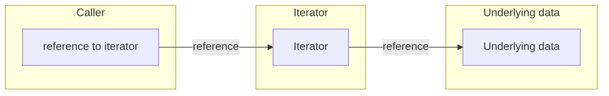

# Questions about your function signatures

## Should I return an iterator or a collection?

> Pretty much always return an iterator. - AH

We suggested you [use iterators a lot in your code](./code.md#how-can-i-avoid-the-performance-penalty-of-bounds-checks). Share the love! Give iterators to your callers too.

Specifically: do you know how your caller will use the items which you're returning to them? If yes, maybe you want to collect your data into a concrete list such as a `Vec` or a `HashSet`. But in all other cases, return an iterator.

Your caller might:
* Collect the iterator into a `Vec`
* Collect it into a `HashSet` or some other specialized container
* Loop over the items
* Filter them or otherwise completely ignore some

Collecting the items into vector will only turn out to be right in one of these cases. In the other cases, you're wasting memory and CPU time by building a concrete collection.

This is weird for C++ programmers because iterators don't usually have robust references into the underlying data. Even Java iterators are scary, throwing `ConcurrentModificationExceptions` when you least expect it. Rust prevents that, at compile time. If you _can_ return an iterator, you should.



## How flexible should my parameters be?

Which of these is best:

```rust
fn a(params: &[String]) {
    // ...
}

fn b(params: &[&str]) {
    // ...
}

fn c(params: &[impl AsRef<str>]) {
    // ...
}
```

The same decision applies in other cases (e.g. `Path`, `PathBuf`, `AsRef<Path>`).

The last one has some advantages: if a caller has a `Vec<String>`, they can use that directly, which would be impossible with the other options. But, if they want to pass an empty list, they'll have to explicitly specify the type (for instance `&Vec::<String>::new()`).

```rust
# fn a(params: &[String]) {
# }
# fn b(params: &[&str]) {
# }
# fn c(params: &[impl AsRef<str>]) {
# }
fn main() {
    a(&[]);
    // a(&["hi"]); // doesn't work
    a(&vec![format!("hello")]);
    b(&[]);
    b(&["hi"]);
    // b(&vec![format!("hello")]); // doesn't work
    // c(&[]); // doesn't work
    c(&["hi"]);
    c(&vec![format!("hello")]);
}
```

So you have a variety of interesting ways _slightly_ to annoy your callers under different circumstances. Which is best?

> Not a huge fan of AsRef everywhere - it's just saving the caller typing. If you have lots of AsRef then nothing is object-safe. - MG

TL;DR: choose the middle option. If your caller happens to have a vector of `String`, it's relatively little work to convert to get a slice of `&str`:

```rust
use std::iter::FromIterator;

# fn b(params: &[&str]) {
# }

fn main() {
    b(&[]);
    b(&["hi"]);
    // Instead of... b(&vec![format!("hello")]);
    let hellos = vec![format!("hello")];
    b(&Vec::from_iter(hellos.iter().map(String::as_str)));
}
```

## How do I overload constructors?

You can't do this:

```rust
# struct Thing;
impl Thing {
    fn new() -> Thing {
#        Self
        // ...
    }

    // Can't add more overloads...
    // fn new(param_a: i32) -> Thing {
    // ...
    //}
    //fn new(param_b: String) -> Thing {
    // ...
    //}
}
```

Instead, use [the builder pattern](https://rust-lang.github.io/api-guidelines/type-safety.html#builders-enable-construction-of-complex-values-c-builder). Specifically, add methods which both take `&mut self` and return `&mut Self`, then they can be [chained into short or long constructions, passing parameters as necessary.](https://rust-lang.github.io/api-guidelines/type-safety.html#non-consuming-builders-preferred)
