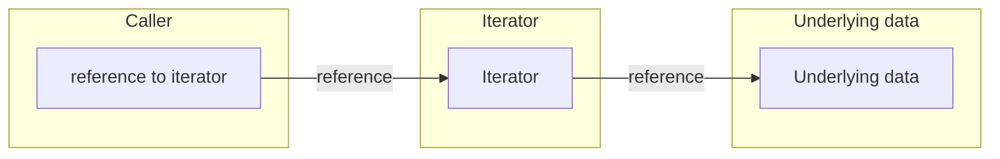

# Questions about your function signatures

## Should I return an iterator or a collection?

> Pretty much always return an iterator. - AH

We suggested you [use iterators a lot in your code](./code.md#how-can-i-avoid-the-performance-penalty-of-bounds-checks). Share the love! Give iterators to your callers too.

If you *know* your caller will store the items you're returning in a concrete collection, such as a `Vec` or a `HashSet`, you may want to return that. In all other cases, return an iterator.

Your caller might:
* Collect the iterator into a `Vec`
* Collect it into a `HashSet` or some other specialized container
* Loop over the items
* Filter them or otherwise completely ignore some

Collecting the items into vector will only turn out to be right in one of these cases. In the other cases, you're wasting memory and CPU time by building a concrete collection.

This is weird for C++ programmers because iterators don't usually have robust references into the underlying data. Even Java iterators are scary, throwing `ConcurrentModificationExceptions` when you least expect it. Rust prevents that, at compile time. If you _can_ return an iterator, you should.



## How flexible should my parameters be?

Which of these is best?

```rust
fn a(params: &[String]) {
    // ...
}

fn b(params: &[&str]) {
    // ...
}

fn c(params: &[impl AsRef<str>]) {
    // ...
}
```

(You'll need to make an equivalent decision in other cases, e.g. `Path` versus `PathBuf` versus `AsRef<Path>`.)

None of the options is clearly superior; for each option, there's a case it can't handle that the others can:

```rust
# fn a(params: &[String]) {
# }
# fn b(params: &[&str]) {
# }
# fn c(params: &[impl AsRef<str>]) {
# }
fn main() {
    a(&[]);
    // a(&["hi"]); // doesn't work
    a(&vec![format!("hello")]);

    b(&[]);
    b(&["hi"]);
    // b(&vec![format!("hello")]); // doesn't work

    // c(&[]); // doesn't work
    c(&["hi"]);
    c(&vec![format!("hello")]);
}
```

So you have a variety of interesting ways to _slightly_ annoy your callers under different circumstances. Which is best?

`AsRef` has some advantages: if a caller has a `Vec<String>`, they can use that directly, which would be impossible with the other options. But if they want to pass an empty list, they'll have to explicitly specify the type (for instance `&Vec::<String>::new()`).

> Not a huge fan of AsRef everywhere - it's just saving the caller typing. If you have lots of AsRef then nothing is object-safe. - MG

TL;DR: choose the middle option, `&[&str]`. If your caller happens to have a vector of `String`, it's relatively little work to get a slice of `&str`:

```rust
# fn b(params: &[&str]) {
# }

fn main() {
    // Instead of b(&vec![format!("hello")]);
    let hellos = vec![format!("hello")];
    b(&hellos.iter().map(String::as_str).collect::<Vec<_>>());
}
```

## How do I overload constructors?

You can't do this:

```rust
# struct BirthdayCard {}
impl BirthdayCard {
    fn new(name: &str) -> Self {
#       Self{}
        // ...
    }

    // Can't add more overloads:
    //
    // fn new(name: &str, age: i32) -> BirthdayCard { ... }
    //
    // fn new(name: &str, text: &str) -> BirthdayCard { ... }
}
```

If you have a default constructor, and a few variants for other cases, you can simply write them as different static methods. An idiomatic way to do this is to write a `new()` constructor and then `with_foo()` constructors that apply the given "foo" when constructing.

```rust
# struct Racoon {}
impl Racoon {
    fn new() -> Self {
#       Self{}
        // ...
    }
    fn with_age(age: usize) -> Self {
#       Self{}
        // ...
    }
}
```

If you have have a bunch of constructors and no default, it may make sense to instead provide a set of `new_foo()` constructors.

```rust
# struct Animal {}
impl Animal {
    fn new_squirrel() -> Self {
#       Self{}
        // ...
    }
    fn new_badger() -> Self {
#       Self{}
        // ...
    }
}
```

For a more complex situation, you may use [the builder pattern](https://rust-lang.github.io/api-guidelines/type-safety.html#builders-enable-construction-of-complex-values-c-builder). The builder has a set of methods which take `&mut self` and return `&mut Self`. Then add a `build()` that returns the final constructed object.

```rust
struct BirthdayCard {}

struct BirthdayCardBuilder {}
impl BirthdayCardBuilder {
    fn new(name: &str) -> Self {
#       Self{}
        // ...
    }

    fn age(&mut self, age: i32) -> &mut Self {
#         self
        // ...
    }

    fn text(&mut self, text: &str) -> &mut Self {
#         self
        // ...
    }

    fn build(&mut self) -> BirthdayCard { BirthdayCard { /* ... */ } }
}
```

You can then [chain these](https://rust-lang.github.io/api-guidelines/type-safety.html#non-consuming-builders-preferred) into short or long constructions, passing parameters as necessary:

```rust
# struct BirthdayCard {}
#
# struct BirthdayCardBuilder {}
# impl BirthdayCardBuilder {
#     fn new(name: &str) -> BirthdayCardBuilder {
#       Self{}
#       // ...
#     }
#
#     fn age(&mut self, age: i32) -> &mut BirthdayCardBuilder {
#         self
#         // ...
#      }
#
#     fn text(&mut self, text: &str) -> &mut BirthdayCardBuilder {
#         self
#         // ...
#      }
#
#     fn build(&mut self) -> BirthdayCard { BirthdayCard { /* ... */ } }
# }
#
fn main() {
    let card = BirthdayCardBuilder::new("Paul")
        .age(64)
        .text("Happy Valentine's Day!")
        .build();
}
```

Note another advantage of builders: Overloaded constructors often don't provide all possible combinations of parameters, whereas with the builder pattern, you can combine exactly the parameters you want.

## When must I use `#[must_use]`?

> Use it on Results and mutex locks. - MG

`#[must_use]` causes a compile error if the caller ignores the return value.

Rust functions are often single-purpose. They either:

* Return a value without any side effects; or
* Do something (i.e. have side effects) and return nothing.

In neither case do you need to think about `#[must_use]`. (In the first case,
nobody would call your function unless they were going to use the result.)

`#[must_use]` is useful for those rarer functions which return a result _and_
have side effects. In most such cases, it's wise to specify `#[must_use]`, unless
the return value is truly optional (for example in
[`HashMap::insert`](https://doc.rust-lang.org/std/collections/struct.HashMap.html#method.insert)).

## When should I take parameters by value?

Move semantics are more common in Rust than in C++.

> In C++ moves tend to be an optimization, whereas in Rust they're a key semantic part of the program. - MY

To a first approximation, you should assume similar performance when passing
things by (moved) value or by reference. It's true that a move may turn out to
be a `memcpy`, but it's often optimized away.

> Express the ownership relationship in the type system, instead of trying to second-guess the compiler for efficiency. - AF

The moves are, of course, destructive - and unlike in C++, the compiler
enforces that you don't reuse a variable that has been moved.
Some C++ objects become toxic after they've moved; that's not a
risk in Rust.

So here's the heuristic: if a caller shouldn't be able to use an object again,
pass it via move semantics in order to consume it.

An extreme example: a UUID is supposed to be globally unique - it might cause a
logic error for a caller to retain knowledge of a UUID after passing it to a callee.

More generally, consume data enthusiastically to avoid logical errors during future
refactorings. For instance, if some command-line options are overridden by a
runtime choice, consume those old options - then any future refactoring which
uses them after that point will give you a compile error. This pattern is
surprisingly effective at spotting errors in your assumptions.

## Should I ever take `self` by value?

Sometimes. If you've got a member function which destroys or transforms a thing,
it should take `self` by value. Examples:

* Closing a file and returning a result code.
* A builder-pattern object which spits out the thing it was building. ([Example](https://docs.rs/bindgen/0.59.0/bindgen/struct.Builder.html#method.generate)).

## How do I take a thing, and a reference to something within that thing?

For example, suppose you want to give all of your dogs to your friend, yet also
tell your friend which one of the dogs is the Best Boy or Girl.

```cpp
struct PetInformation {
  std::vector<Dog> dogs;
  Dog& BestBoy;
  Dog& BestGirl;
}

PetInformation GetPetInformation() {
  // ...
}
```

Generally this is an indication that your types or functions are not split down
in the correct
way:

> This is a decomposition problem. Once you’ve found the correct decomposition, everything
> else just works. The code almost writes itself. - AF

```rust
# struct Dog;
struct PetInformation(Vec<Dog>);

fn get_pet_information() -> PetInformation {
  // ...
# PetInformation(Vec::new())
}

fn identify_best_boy(pet_information: &PetInformation) -> &Dog {
  // ...
  # pet_information.0.get(0).unwrap()
}
```

One use-case is when you want to act on some data, depending on its contents...
but you also wanted to do something with those contents that you previously
identified.

```rust
# struct Key;
struct Door { locked: bool }

struct Car {
  ignition: Option<Key>,
  door: Door,
}

fn steal_car(car: Car) {
  match car {
    Car {
      ignition: Some(ref key),
      door: Door { locked: false }
    } => drive_away_normally(car /* , key */),
    _ => break_in_and_hotwire(car)
  }
}

fn drive_away_normally(car: Car /* , key: &Key */) {
  // Annoying to have to repeat this code...
  let key = match car {
    Car {
      ignition: Some(ref key),
      ..
    } => key,
    _ => unreachable!()
  };
  turn_key(key);
  // ...
}

# fn turn_key(key: &Key) {}
# fn break_in_and_hotwire(car: Car) {}
```

If this repeated matching gets annoying, it's relatively easy
to extract it to a function.

```rust
# fn turn_key(key: &Key) {}
# fn break_in_and_hotwire(car: Car) {}
# struct Key;
# struct Door { locked: bool }
# struct Car {
  # ignition: Option<Key>,
  # door: Door,
# }

impl Car {
  fn get_usable_key(&self) -> Option<&Key> {
    match self {
      Car {
        ignition: Some(ref key),
        door: Door { locked: false }
      } => Some(key),
      _ => None,
    }
  }
}

fn steal_car(car: Car) {
  match car.get_usable_key() {
    None => break_in_and_hotwire(car),
    Some(_) => drive_away_normally(car),
  }
}

fn drive_away_normally(car: Car) {
  turn_key(car.get_usable_key().unwrap());
}
```

## When should I return `impl Trait`?

Your main consideration should be API stability. If your caller doesn't
_need_ to know the concrete implementation type, then don't tell it. That
gives you flexibility to change your implementation in future without breaking
compatibility.

Note [Hyrum's Law](https://www.hyrumslaw.com/)!

Using `impl Trait` doesn't solve _all_ possible API stability concerns, because
even `impl Trait` leaks auto-traits such as `Send` and `Sync`.

## I miss function overloading! What do I do?

Use a trait to implement the behavior you used to have.

For example, in C++:

```cpp
class Dog {
public:
  void eat(Dogfood);
  void eat(DeliveryPerson);
};
```

In Rust you might express this as:

```rust
trait Edible {
};

struct Dog;

impl Dog {
  fn eat(edible: impl Edible) {
    // ...
  }
}

struct Dogfood;
struct DeliveryPerson;

impl Edible for Dogfood {}
impl Edible for DeliveryPerson {}
```

This gives your caller all the convenience they want, though may increase
work for you as the implementer.

## I miss operator overloading! What do I do?

Implement the standard traits instead (for example `PartialEq`, `Add`). This
has equivalent effect in that folks will be able to use your type in a standard
Rusty way without knowing too much special about your type.

