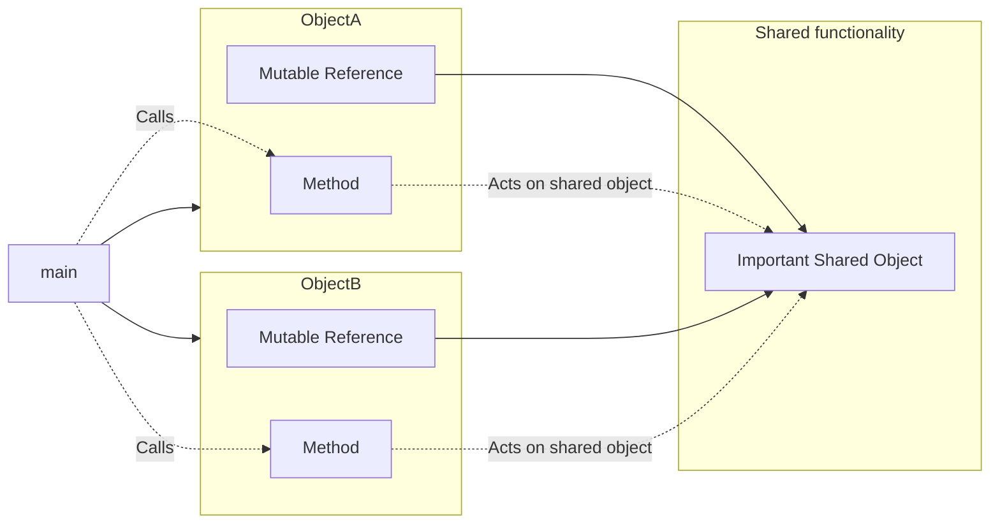
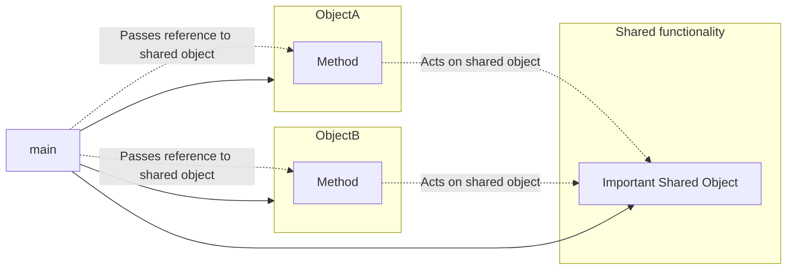
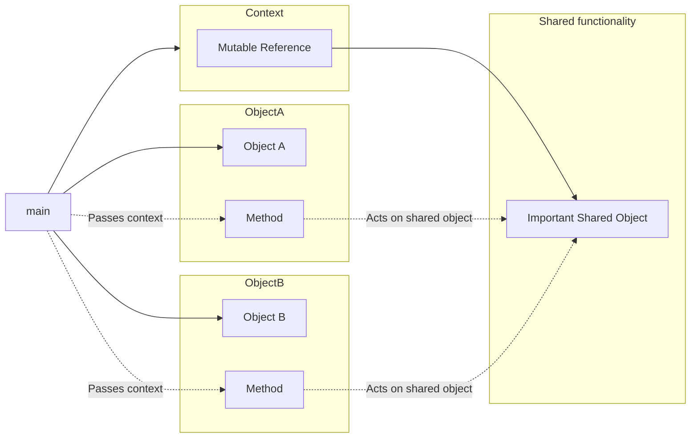

# Questions about your types

## My 'class' needs references to lots of other things in order to do its job, and that conflicts with other things which also hold similar references. What do I do?

It's common in C++ to have objects which need to mutate other objects to get
their work done. Those other objects may be accessed by several different
objects.



You can't have multiple mutable references to a shared object, so what do you do?

First of all, consider moving behavior out of your types. (See
[the answer about the observer pattern](./codebase.md#the-c-observer-pattern-is-hard-in-rust-what-to-do) and especially
[the second option described there](./codebase.md#option-2-drive-the-objects-from-the-code-not-the-other-way-round).)

Even in Rust, though, it's still often the best choice to have complex
behavior as part of types within `impl` blocks. You can still do that -
but don't _store_ references. Instead, pass them into each function call.



Instead of:

```rust
struct ImportantSharedObject;

struct ObjectA<'a> {
    important_shared_object: &'a mut ImportantSharedObject,
}

impl<'a> ObjectA<'a> {
    fn new(important_shared_object: &'a mut ImportantSharedObject) -> Self {
        Self {
            important_shared_object
        }
    }
    fn do_something(&mut self) {
        // act on self.important_shared_object
    }
}

fn main() {
    let mut shared_thingy = ImportantSharedObject;
    let mut a = ObjectA::new(&mut shared_thingy);
    a.do_something();
}
```

Do this:

```rust
struct ImportantSharedObject;

struct ObjectA;

impl ObjectA {
    fn new() -> Self {
        Self
    }
    fn do_something(&mut self, important_shared_object: &mut ImportantSharedObject) {
        // act on important_shared_object
    }
}

fn main() {
    let mut shared_thingy = ImportantSharedObject;
    let mut a = ObjectA::new();
    a.do_something(&mut shared_thingy);
}
```

(happily this also gets rid of named lifetime parameters.)

If you have a hundred such shared objects, you probably don't want a
hundred function parameters. So it's usual to bundle them up into
a context structure which can be passed into each function call:

```rust
struct ImportantSharedObject;
struct AnotherImportantObject;

struct Ctx<'a> {
    important_shared_object: &'a mut ImportantSharedObject,
    another_important_object: &'a mut AnotherImportantObject,
}

struct ObjectA;

impl ObjectA {
    fn new() -> Self {
        Self
    }
    fn do_something(&mut self, ctx: &mut Ctx) {
        // act on ctx.important_shared_object and ctx.another_important_thing
    }
}

fn main() {
    let mut shared_thingy = ImportantSharedObject;
    let mut another_thingy = AnotherImportantObject;
    let mut ctx = Ctx {
        important_shared_object: &mut shared_thingy,
        another_important_object: &mut another_thingy,
    };
    let mut a = ObjectA::new();
    a.do_something(&mut ctx);
}
```



Even simpler: just put all the data directly into `Ctx`. But the key point
is that this context object is passed around into just about all function calls
rather than being stored anywhere, thus negating any borrowing/lifetime concerns.

This pattern can be seen in, for example, [bindgen](https://github.com/rust-lang/rust-bindgen/blob/271eeb0782d34942267ceabcf5f1cf118f0f5842/src/ir/context.rs#L308).

> Split out borrowing concerns from the object concerns. - MG

(To generalize this idea, try to avoid storing references to anything that might
need to be changed. Instead take those things as parameters. For instance
`petgraph` [takes the entire graph as context to a `Walker` object](https://docs.rs/petgraph/0.6.0/petgraph/visit/trait.Walker.html), such that the graph can be changed whilst you're walking it.)