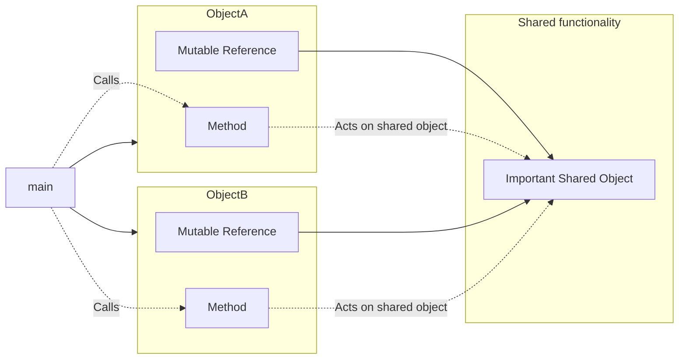
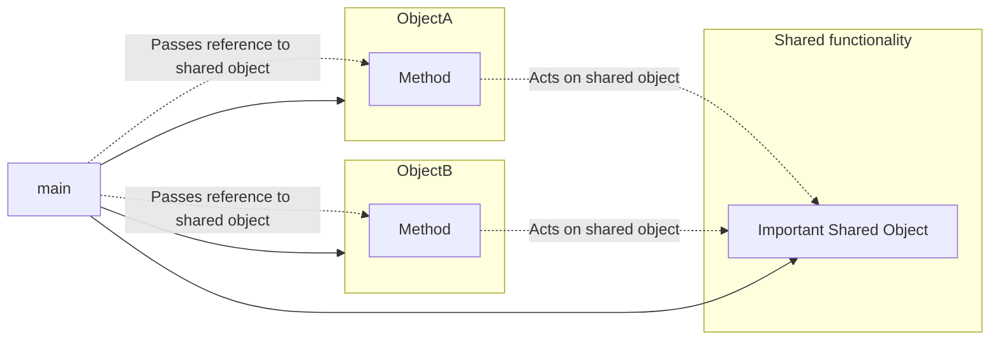
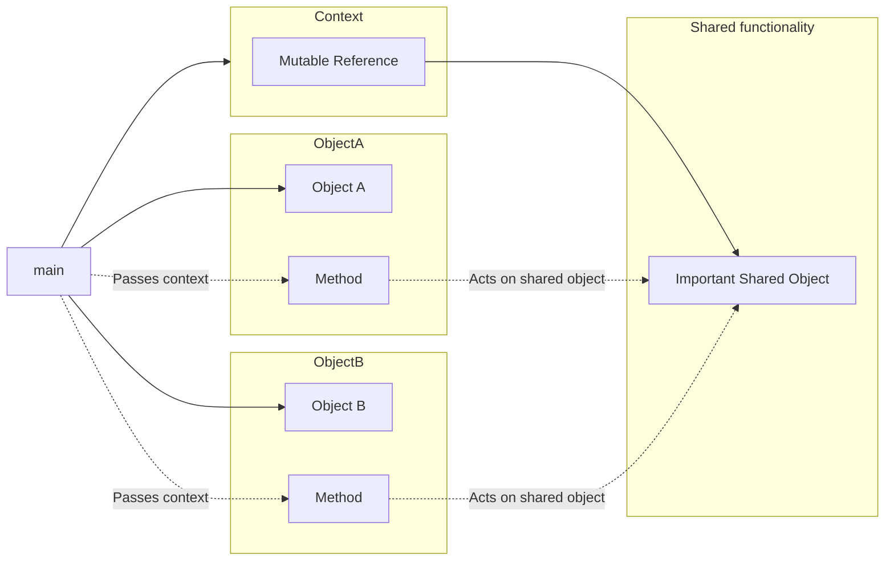

# Questions about your types

## My 'class' needs mutable references to other things to do its job. Other classes need mutable references to these things too. What do I do?

It's common in C++ to have a class that contain mutable references to other
objects; the class mutates those objects to do its work. Often, there
are several classes that all hold a mutable reference to the same object. Here
is a diagram that illustrates this:



In Rust, you can't have multiple mutable references to a shared object, so what
do you do?

First of all, consider moving behavior out of your types. (See
[the answer about the observer pattern](./codebase.md#the-c-observer-pattern-is-hard-in-rust-what-to-do) and especially
[the second option described there](./codebase.md#option-2-drive-the-objects-from-the-code-not-the-other-way-round).)

Even in Rust, though, it's still often the best choice to make complex behavior
part of the type within `impl` blocks. You can still do that - but don't
_store_ references. Instead, pass them into each function call.



Instead of this:

```rust
# struct ImportantSharedObject;
# struct ObjectA<'a> {
#    important_shared_object: &'a mut ImportantSharedObject,
# }
# impl<'a> ObjectA<'a> {
#    fn new(important_shared_object: &'a mut ImportantSharedObject) -> Self {
#        Self {
#            important_shared_object
#        }
#    }
#    fn do_something(&mut self) {
#        // act on self.important_shared_object
#    }
# }
fn main() {
    let mut shared_thingy = ImportantSharedObject;
    let mut a = ObjectA::new(&mut shared_thingy);
    a.do_something(); // acts on shared_thingy
}
```

Do this:

```rust
# struct ImportantSharedObject;
# struct ObjectA;
# impl ObjectA {
#    fn new() -> Self {
#        Self
#    }
#    fn do_something(&mut self, important_shared_object: &mut ImportantSharedObject) {
#        // act on important_shared_object
#    }
# }
fn main() {
    let mut shared_thingy = ImportantSharedObject;
    let mut a = ObjectA::new();
    a.do_something(&mut shared_thingy); // acts on shared_thingy
}
```

(Happily this also gets rid of named lifetime parameters.)

If you have a hundred such shared objects, you probably don't want a
hundred function parameters. So it's usual to bundle them up into
a context structure which can be passed into each function call:

```rust
# struct ImportantSharedObject;
# struct AnotherImportantObject;
struct Ctx<'a> {
    important_shared_object: &'a mut ImportantSharedObject,
    another_important_object: &'a mut AnotherImportantObject,
}

# struct ObjectA;
# impl ObjectA {
#    fn new() -> Self {
#        Self
#    }
#    fn do_something(&mut self, ctx: &mut Ctx) {
#        // act on ctx.important_shared_object and ctx.another_important_thing
#    }
# }
fn main() {
    let mut shared_thingy = ImportantSharedObject;
    let mut another_thingy = AnotherImportantObject;
    let mut ctx = Ctx {
        important_shared_object: &mut shared_thingy,
        another_important_object: &mut another_thingy,
    };
    let mut a = ObjectA::new();
    a.do_something(&mut ctx); // acts on both the shared thingies
}
```



Even simpler: just put all the data directly into `Ctx`. But the key point
is that this context object is passed around into just about all function calls
rather than being stored anywhere, thus negating any borrowing/lifetime concerns.

This pattern can be seen in [bindgen](https://github.com/rust-lang/rust-bindgen/blob/271eeb0782d34942267ceabcf5f1cf118f0f5842/src/ir/context.rs#L308),
for example.

> Split out borrowing concerns from the object concerns. - MG

To generalize this idea, try to avoid storing references to anything that might
need to be changed. Instead take those things as parameters. For instance
`petgraph` [takes the entire graph as context to a `Walker` object](https://docs.rs/petgraph/0.6.0/petgraph/visit/trait.Walker.html),
such that the graph can be changed while you're walking it.

## My type needs to store arbitrary user data. What do I do instead of `void *`?

Ideally, your type would know all possible types of user data that it could store.
You'd represent this as an `enum` with variant data for each possibility. This
would give complete compile-time type safety.

But sometimes code needs to store data for which it can't depend upon
the definition: perhaps it's defined by a totally different area of the
codebase, or belongs to clients. Such possibilities can't be enumerated in
advance. Until recently, the only real option in C++ was to use a `void *`
and have clients downcast to get their original type back. Modern C++ offers
a much better option, `std::any`; if you've come across that, Rust's equivalent
will seem very familiar.

In Rust, the [`Any`](https://doc.rust-lang.org/std/any/trait.Any.html) type
allows you to store _anything_ and retrieve it later in a type-safe fashion:

```rust
use std::any::Any;

struct MyTypeOfUserData(u8);

fn main() {
  let any_user_data: Box<dyn Any> = Box::new(MyTypeOfUserData(42));
  let stored_value = any_user_data.downcast_ref::<MyTypeOfUserData>().unwrap().0;
  println!("{}", stored_value);
}
```

If you want to be more prescriptive about what can be stored, you can define
a trait (let's call it `UserData`) and store a `Box<dyn UserData>`.
Your trait should have a method `fn as_any(&self) -> &dyn std::any::Any;`
Each implementation can just return `self`.

Your caller can then do this:

```rust
trait UserData {
  fn as_any(&self) -> &dyn std::any::Any;
  // ...other trait methods which you wish to apply to any UserData...
}

struct MyTypeOfUserData(u8);

impl UserData for MyTypeOfUserData {
  fn as_any(&self) -> &dyn std::any::Any { self }
}

fn main() {
  // Store a generic Box<dyn UserData>
  let user_data: Box<dyn UserData> = Box::new(MyTypeOfUserData(42));
  // Get back to a specific type
  let stored_value = user_data.as_any().downcast_ref::<MyTypeOfUserData>().unwrap().0;
  println!("{}", stored_value);
}
```

Of course, enumerating all possible stored variants remains preferable such that the
compiler helps you to avoid runtime panics.

## When should I put my data in a `Box`?

In C++, you often need to box things for ownership reasons, whereas in Rust
it's typically just a performance trade-off. It's arguably premature optimization
to use boxes unless your profiling shows a lot of memcpy of that particular
type (or, perhaps, the relevant [clippy lint](https://rust-lang.github.io/rust-clippy/v0.0.212/index.html#large_enum_variant)
informs you that you have a problem.)

> I never box things unless it’s really big - MG

Another heuristic is if part of your data structure is very rarely filled,
in which case you may wish to `Box` it to avoid incurring an overhead for all
other instances of the type.

```rust
# struct Humility; struct Talent; struct Ego;
struct Popstar {
  ego: Ego,
  talent: Talent,
  humility: Option<Box<Humility>>,
}
# fn main() {}
```

(This is one reason why people like using [anyhow](https://docs.rs/anyhow/latest/anyhow/)
for their errors; it means the failure case in their `Result` enum is only
a pointer wide.)

Of course, Rust may require you to use a box:

* if you need to `Pin` some data, typically for async Rust
* if you otherwise have an infinitely sized data structure.

but as usual, the compiler will explain very nicely.

## When should my type implement `Default`?

Whenever you'd provide a default constructor in C++.

## When should my type implement `From`, `Into` and `TryFrom`?

You should think of these as equivalent to implicit conversions in C++. Just
as with C++, if there are _multiple_ ways to convert from your thing to another
thing, don't implement these, but if there's a single obvious conversion, do.

Usually, don't implement `Into` but instead implement `From`.

## When should my type implement `AsRef`?

If you have a type which contains another type, provide `AsRef` especially
so that people can clone the inner type. It's good practice to provide explicit
versions as well (for example, `String` implements `AsRef<str>` but also
provides `.as_str()`.)

## I miss operator overloading! What do I do?

Implement the standard traits instead. This has equivalent effect in that
folks will be able to use your type in a standard Rusty way without knowing
too much special about your type.

## Should I have public fields or accessor methods?

The trade-offs are similar to C++ except that Rust's pattern-matching makes it
very convenient to match on fields, so within a realm of code that you own you
may bias towards having more public fields than you're used to. As with C++,
this can give you a future compatibility burden.

## When should I use a newtype wrapper?

The [newtype wrapper pattern](https://rust-unofficial.github.io/patterns/patterns/behavioural/newtype.html)
uses Rust's type systems to enforce extra behavior without necessarily changing
the underlying representation.

```rust
# fn get_rocket_length() -> Inches { Inches(7) }
struct Inches(u32);
struct Centimeters(u32);

fn build_mars_orbiter() {
  let rocket_length: Inches = get_rocket_length();
  // mate_to_orbiter(rocket_length); // does not compile because this takes cm
}
```

Other examples that have been used:
* An IP address which is guaranteed not to be localhost;
* Non-zero numbers;
* IDs which are guaranteed to be unique

Such new types typically need a lot of boilerplate, especially to implement
the traits which users of your type would expect to find. On the other hand,
they allow you to use Rust's type system to statically prevent logic bugs.

A heuristic: if there are some invariants you'd be checking for at runtime,
see if you can use a newtype wrapper to do it statically instead. Although it
may be more code to start with, you'll save the effort of finding and fixing
logic bugs later.

## How else can I use Rust's type system to avoid high-level logic bugs?

Yes.

*Zero sized types* ("ZSTs"). Often used as capability tokens - you can statically
prove that code exclusively has the right to do something. For example:

```rust
struct PermissionToUseCamera;

fn prompt_user_for_permission() -> Option<PermissionToUseCamera> {
  // ...
#  None
}

// Statically proven that no code calls this unless it's attempted to
// get permission and dealt with the consequences of rejection.
fn take_photo(permission: &PermissionToUseCamera) {
  // ...
}

//fn main() { }
```

ZSTs can also be used to demonstrate _exclusive_ access to some resource.

```rust
struct RobotArmAccessToken;

fn move_arm(token: &mut RobotArmAccessToken, x: u32, y: u32, z: u32) {
  // ...
}

fn attach_car_door(token: &mut RobotArmAccessToken) {
  move_arm(token, 3, 4, 6);
  move_arm(token, 5, 3, 6);
}

fn install_windscreen(token: &mut RobotArmAccessToken) {
  move_arm(token, 7, 8, 2);
  move_arm(token, 1, 2, 3);
}

fn main() {
  let mut token = RobotArmAccessToken; // ensure only one exists
  attach_car_door(&mut token);
  install_windscreen(&mut token);
}
```

(the type system would prevent these operations happening in parallel).

*Marker traits*. Indicate that a type meets certain invariants, so subsequent
users of that type don't need to check at runtime. A common example is to
indicate that a type is safe to serialize into some bytestream.

*Enums as state machines*. Each enum variant is a state and stores data
associated with that state. There simply is no possibility that the data can
get out of sync with the state.

```rust
enum ElectionState {
  RaisingDonations { amount_raised: u32 },
  DoingTVInterviews { interviews_done: u16 },
  Voting { votes_for_me: u64, votes_for_opponent: u64 },
  Elected,
  NotElected,
};
```

(A more heavyweight approach here is to define types for each state, and
allow valid state transitions by taking the previous state by-value and
returning the next state by-value.)

```rust
struct Seed { water_available: u32 }
struct Growing { water_available: u32, sun_available: u32 }
struct Flowering;
struct Dead;

enum PlantState {
  Seed(Seed),
  Growing(Growing),
  Flowering(Flowering),
  Dead(Dead)
}

impl Seed {
  fn advance(self) -> PlantState {
    if self.water_available > 3 {
      PlantState::Growing(Growing { water_available: self.water_available, sun_available: 0 })
    } else {
      PlantState::Dead(Dead)
    }
  }
}

impl Growing {
  fn advance(self) -> PlantState {
    if self.water_available > 3 && self.sun_available > 3 {
      PlantState::Flowering(Flowering)
    } else {
      PlantState::Dead(Dead)
    }
  }
}

impl Flowering {
  fn advance(self) -> PlantState {
    PlantState::Dead(Dead)
  }
}

impl Dead {
  fn advance(self) -> PlantState {
    PlantState::Dead(Dead)
  }
}

impl PlantState {
  fn advance(self) -> Self {
    match self {
      Self::Seed(seed) => seed.advance(),
      Self::Growing(growing) => growing.advance(),
      Self::Flowering(flowering) => flowering.advance(),
      Self::Dead(dead) => dead.advance(),
    }
  }
}

// we should probably find a way to inject some sun and water into this
// state machine or things are not looking rosy
```

## When should I use `Rc` versus `Arc`?

Never expose `Rc` in APIs. `Arc` is the right choice nearly always. (You
might want to look at the [archery crate](https://docs.rs/archery/latest/archery/)).

## What should I do instead of inheritance?

Use composition. Sometimes this results in more boilerplate, but it avoids
a raft of complexity.

Specifically, for example:
* you might include the "superclass" struct as a member of the subclass
  struct;
* you might use an enum with different variants for the different possible
  "subclasses".

Usually the answer is obvious: it's unlikely that your Rust code is structured
in such a way that inheritance would be a good fit anyway.

> I've only missed inheritance when actually implementing languages which
> themselves have inheritance - MG.


## I need a list of nodes which can refer to one another. How?

You can't easily do self-referential data structures in Rust. The usual workaround is to [use an arena](https://manishearth.github.io/blog/2021/03/15/arenas-in-rust/) and replace references from one node to another with node IDs.

An arena is typically a `Vec` (or similar), and the node IDs are a newtype wrapper around a simple integer index.

Obviously, Rust doesn't check that your node IDs are valid. If you don't have proper references, what stops you from having stale IDs?

Arenas are often purely additive, which means that you can add entries but not delete them ([example](https://github.com/Manishearth/elsa/blob/master/examples/mutable_arena.rs)). If you must have an arena which deletes things, then use generational IDs; see the [generational-arena](https://docs.rs/generational-arena/) crate and this [RustConf keynote](https://www.youtube.com/watch?v=aKLntZcp27M) for more details.

If arenas still sound like a nasty workaround, consider that you might choose an arena anyway for other reasons:

* All of the objects in the arena will be freed at the end of the arena's lifetime, instead of during their manipulation, which can give very low latency for some use-cases. [Bumpalo](https://docs.rs/bumpalo/3.6.1/bumpalo/) formalizes this.
* The rest of your program might have real Rust references into the arena. You can give the arena a named lifetime (`'arena` for example), making the provenance of those references very clear.

## I'm having a miserable time making my data structure. Should I use unsafe?

Low-level data structures are _hard_ in Rust. Arguably, Rust merely makes plain
all the lifetime and ownership issues which you already had in other languages, but
the compiler is brutal about it, and you're going to have a bad day.

Even something as simple as a doubly-linked list is notoriously hard; so much so
that there is a [book that teaches Rust based solely on linked lists](https://rust-unofficial.github.io/too-many-lists/).
As that (wonderful) book makes clear, you are often faced with a choice:

* [Use safe Rust, but shift compile-time checks to runtime](https://rust-unofficial.github.io/too-many-lists/fourth.html)
* [Use `unsafe`](https://rust-unofficial.github.io/too-many-lists/fifth.html) and
take the same degree of care you'd take in C or C++. And, just like in C or C++,
you'll introduce [security vulnerabilities in the unsafe code](https://www.cvedetails.com/vulnerability-list/vendor_id-19029/product_id-48677/Rust-lang-Rust.html).

If you're facing this decision... perhaps there's a third way.

You should almost always be using somebody else's tried-and-tested
data structure.

[petgraph](https://docs.rs/petgraph) and
[slotmap](https://docs.rs/slotmap) are great examples. Use someone else's crate
by default, and resort to writing your own only if you exhaust that option.

C++ makes it hard to pull in third-party dependencies, so it's culturally normal
to write new code. Rust makes it trivial to add dependencies, and so you will
need to do that, even if it feels awkward for a C++ programmer.

This _ease_ of adding dependencies **co-evolved** with the
_difficulty_ of making data structures. It's simply a part of programming in Rust.
You just can't separate the language and the ecosystem.

You might argue that this dependency on third-party crates is concerning
from a supply-chain security point of view. Your author would agree, but
it's just the way you do things in Rust. Stop creating your own data structures.

Then again:

> it’s equally miserable to implement performant, low-level data structures in
> C++; you’ll be specializing on lots of things like is_trivially_movable etc. - MY.

## I nevertheless have to write my own data structure. Should I use unsafe?

I'm sorry to hear that.

Some suggestions:

* Use `Rc`, weak etc. until you really can't.
* Even if you can't use a pre-existing crate for the whole data structure,
  perhaps you can use a crate to avoid the `unsafe` bits (for example
  [rental](https://docs.rs/rental/latest/rental/))
* Bear in mind that refactoring Rust is generally safer than refactoring
  C++ (because the compiler will point out a higher proportion of your
  mistakes) so a wise strategy might be to start with a fully-safe, but slow,
  version, establish solid tests, and then reach for unsafe.

