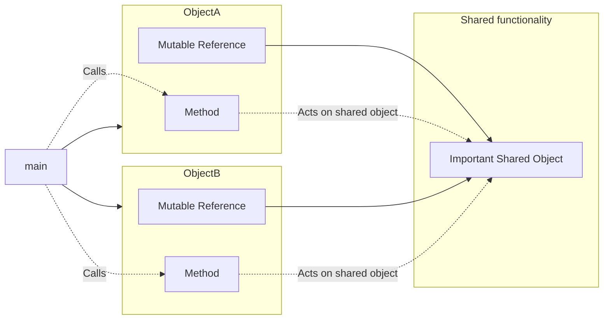
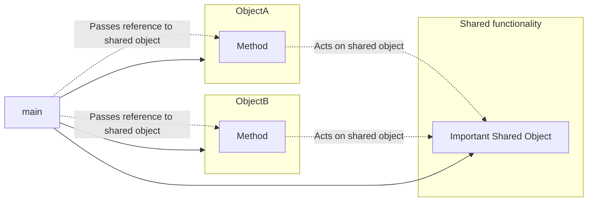
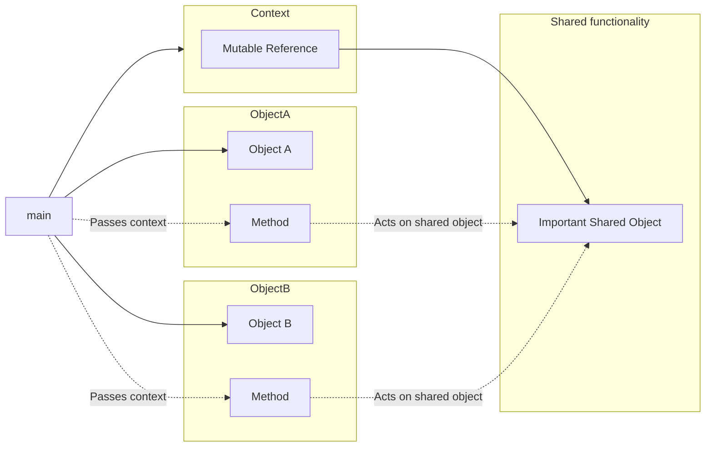

# Questions about your types

## My 'class' needs mutable references to other things to do its job. Other classes need mutable references to these things too. What do I do?

It's common in C++ to have a class that contain mutable references to other
objects; the class mutates those objects to do its work. Often, there
are several classes that all hold a mutable reference to the same object. Here
is a diagram that illustrates this:



In Rust, you can't have multiple mutable references to a shared object, so what
do you do?

First of all, consider moving behavior out of your types. (See
[the answer about the observer pattern](./codebase.md#the-c-observer-pattern-is-hard-in-rust-what-to-do) and especially
[the second option described there](./codebase.md#option-2-drive-the-objects-from-the-code-not-the-other-way-round).)

Even in Rust, though, it's still often the best choice to make complex behavior
part of the type within `impl` blocks. You can still do that - but don't
_store_ references. Instead, pass them into each function call.



Instead of this:

```rust
# struct ImportantSharedObject;
# struct ObjectA<'a> {
#    important_shared_object: &'a mut ImportantSharedObject,
# }
# impl<'a> ObjectA<'a> {
#    fn new(important_shared_object: &'a mut ImportantSharedObject) -> Self {
#        Self {
#            important_shared_object
#        }
#    }
#    fn do_something(&mut self) {
#        // act on self.important_shared_object
#    }
# }
fn main() {
    let mut shared_thingy = ImportantSharedObject;
    let mut a = ObjectA::new(&mut shared_thingy);
    a.do_something(); // acts on shared_thingy
}
```

Do this:

```rust
# struct ImportantSharedObject;
# struct ObjectA;
# impl ObjectA {
#    fn new() -> Self {
#        Self
#    }
#    fn do_something(&mut self, important_shared_object: &mut ImportantSharedObject) {
#        // act on important_shared_object
#    }
# }
fn main() {
    let mut shared_thingy = ImportantSharedObject;
    let mut a = ObjectA::new();
    a.do_something(&mut shared_thingy); // acts on shared_thingy
}
```

(Happily this also gets rid of named lifetime parameters.)

If you have a hundred such shared objects, you probably don't want a
hundred function parameters. So it's usual to bundle them up into
a context structure which can be passed into each function call:

```rust
# struct ImportantSharedObject;
# struct AnotherImportantObject;
struct Ctx<'a> {
    important_shared_object: &'a mut ImportantSharedObject,
    another_important_object: &'a mut AnotherImportantObject,
}

# struct ObjectA;
# impl ObjectA {
#    fn new() -> Self {
#        Self
#    }
#    fn do_something(&mut self, ctx: &mut Ctx) {
#        // act on ctx.important_shared_object and ctx.another_important_thing
#    }
# }
fn main() {
    let mut shared_thingy = ImportantSharedObject;
    let mut another_thingy = AnotherImportantObject;
    let mut ctx = Ctx {
        important_shared_object: &mut shared_thingy,
        another_important_object: &mut another_thingy,
    };
    let mut a = ObjectA::new();
    a.do_something(&mut ctx); // acts on both the shared thingies
}
```



Even simpler: just put all the data directly into `Ctx`. But the key point
is that this context object is passed around into just about all function calls
rather than being stored anywhere, thus negating any borrowing/lifetime concerns.

This pattern can be seen in [bindgen](https://github.com/rust-lang/rust-bindgen/blob/271eeb0782d34942267ceabcf5f1cf118f0f5842/src/ir/context.rs#L308),
for example.

> Split out borrowing concerns from the object concerns. - MG

To generalize this idea, try to avoid storing references to anything that might
need to be changed. Instead take those things as parameters. For instance
`petgraph` [takes the entire graph as context to a `Walker` object](https://docs.rs/petgraph/0.6.0/petgraph/visit/trait.Walker.html),
such that the graph can be changed while you're walking it.

## My type needs to store arbitrary user data. What do I do instead of `void *`?

Ideally, your type would know all possible types of user data that it could store.
You'd represent this as an `enum` with variant data for each possibility. This
would give complete compile-time type safety.

But sometimes code needs to store data for which it can't depend upon
the definition: perhaps it's defined by a totally different area of the
codebase, or belongs to clients. Such possibilities can't be enumerated in
advance. Until recently, the only real option in C++ was to use a `void *`
and have clients downcast to get their original type back. Modern C++ offers
a much better option, `std::any`; if you've come across that, Rust's equivalent
will seem very familiar.

In Rust, the [`Any`](https://doc.rust-lang.org/std/any/trait.Any.html) type
allows you to store _anything_ and retrieve it later in a type-safe fashion:

```rust
use std::any::Any;

struct MyTypeOfUserData(u8);

fn main() {
  let any_user_data: Box<dyn Any> = Box::new(MyTypeOfUserData(42));
  let stored_value = any_user_data.downcast_ref::<MyTypeOfUserData>().unwrap().0;
  println!("{}", stored_value);
}
```

If you want to be more prescriptive about what can be stored, you can define
a trait (let's call it `UserData`) and store a `Box<dyn UserData>`.
Your trait should have a method `fn as_any(&self) -> &dyn std::any::Any;`
Each implementation can just return `self`.

Your caller can then do this:

```rust
trait UserData {
  fn as_any(&self) -> &dyn std::any::Any;
  // ...other trait methods which you wish to apply to any UserData...
}

struct MyTypeOfUserData(u8);

impl UserData for MyTypeOfUserData {
  fn as_any(&self) -> &dyn std::any::Any { self }
}

fn main() {
  // Store a generic Box<dyn UserData>
  let user_data: Box<dyn UserData> = Box::new(MyTypeOfUserData(42));
  // Get back to a specific type
  let stored_value = user_data.as_any().downcast_ref::<MyTypeOfUserData>().unwrap().0;
  println!("{}", stored_value);
}
```

Of course, enumerating all possible stored variants remains preferable such that the
compiler helps you to avoid runtime panics.

## When should I put my data in a `Box`?

In C++, you often need to box things for ownership reasons, whereas in Rust
it's typically just a performance trade-off. It's arguably premature optimization
to use boxes unless your profiling shows a lot of memcpy of that particular
type (or, perhaps, the relevant [clippy lint](https://rust-lang.github.io/rust-clippy/v0.0.212/index.html#large_enum_variant)
informs you that you have a problem.)

> I never box things unless it’s really big - MG

Another heuristic is if part of your data structure is very rarely filled,
in which case you may wish to `Box` it to avoid incurring an overhead for all
other instances of the type.

```rust
# struct Humility; struct Talent; struct Ego;
struct Popstar {
  ego: Ego,
  talent: Talent,
  humility: Option<Box<Humility>>,
}
# fn main() {}
```

(This is one reason why people like using [anyhow](https://docs.rs/anyhow/latest/anyhow/)
for their errors; it means the failure case in their `Result` enum is only
a pointer wide.)

Of course, Rust may require you to use a box:

* if you need to `Pin` some data, typically for async Rust
* if you otherwise have an infinitely sized data structure.

but as usual, the compiler will explain very nicely.

## When should my type implement `Default`?

Whenever you'd provide a default constructor in C++.

## When should my type implement `From`, `Into` and `TryFrom`?

You should think of these as equivalent to implicit conversions in C++. Just
as with C++, if there are _multiple_ ways to convert from your thing to another
thing, don't implement these, but if there's a single obvious conversion, do.

Usually, don't implement `Into` but instead implement `From`.

## When should my type implement `AsRef`?

If you have a type which contains another type, provide `AsRef` especially
so that people can clone the inner type. It's good practice to provide explicit
versions as well (for example, `String` implements `AsRef<str>` but also
provides `.as_str()`.)

## I miss operator overloading! What do I do?

Implement the standard traits instead. This has equivalent effect in that
folks will be able to use your type in a standard Rusty way without knowing
too much special about your type.
